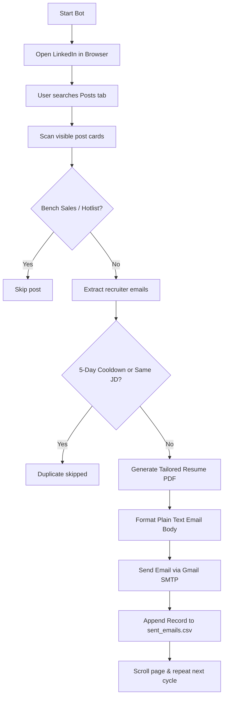

# LinkedIn Recruiter Job Application Bot

An automated tool that scans LinkedIn for recruiter job postings, tailors resume PDFs using ReportLab/AI, applies multi-layer deduplication (5-day recruiter cooldown + Job Description content comparison), sends plain text application emails with tailored resumes attached, and logs all submissions to a structured CSV file.

---

## 📋 Table of Contents
1. [Prerequisites](#1-prerequisites)
2. [Quick Installation](#2-quick-installation)
3. [Environment Configuration (.env)](#3-environment-configuration-env)
4. [Candidate Profile Customization](#4-candidate-profile-customization)
5. [How to Run the Bot](#5-how-to-run-the-bot)
6. [How the Bot Works](#6-how-the-bot-works)
7. [CSV Logging Schema](#7-csv-logging-schema)
8. [Troubleshooting & FAQ](#8-troubleshooting--faq)

---

## 1. Prerequisites

- **Python 3.8+** installed on your system.
- **Google Chrome / Playwright Chromium** browser.
- **Gmail Account with 2-Step Verification** enabled to generate an **App Password**.

---

## 2. Quick Installation

Open your terminal / command prompt in this directory (`c:\Users\VICTUS\Downloads\test`) and run:

```bash
# 1. Install required Python packages
pip install pandas python-dotenv playwright yagmail openai reportlab

# 2. Install Playwright browser binaries
playwright install
```

---

## 3. Environment Configuration (`.env`)

Create or update your `.env` file in the root directory:

```env
GMAIL_ID=your_email@gmail.com
GMAIL_APP_PASSWORD=your_16_char_app_password
OPENAI_API_KEY=sk-proj-xxxxxxxxxxxxxxxxxxxx
OPENAI_MODEL=gpt-4o-mini
```

### How to Generate a Gmail App Password:
1. Go to your Google Account: [https://myaccount.google.com/security](https://myaccount.google.com/security)
2. Ensure **2-Step Verification** is turned **ON**.
3. Go to **App Passwords**: [https://myaccount.google.com/apppasswords](https://myaccount.google.com/apppasswords)
4. Enter an app name (e.g., `LinkedIn Bot`) and click **Create**.
5. Copy the 16-character code (without spaces) and paste it as `GMAIL_APP_PASSWORD` in your `.env` file.

> [!NOTE]
> `OPENAI_API_KEY` is optional. If you don't have credits or an API key, the bot automatically falls back to its built-in keyword tailoring engine without any issues.

---

## 4. Candidate Profile Customization

Open `main.py` and update the `CANDIDATE` dictionary (around line 50) with your real details:

```python
CANDIDATE = {
    "name": "Your Full Name",
    "email": "your_email@gmail.com",
    "phone": "+1 (555) 000-0000",
    "linkedin": "https://www.linkedin.com/in/your-profile/",
    "location": "Tampa, FL",
    "relocation": "Open for relocation",
    "work_auth": "STEM OPT / Citizen / Green Card",
    "availability": "Immediate / Within 2 Weeks",
    "experience": "6+ Years",
    "salary": "Open to Opportunities"
}
```

---

## 5. How to Run the Bot

Run the script from your terminal:

```bash
python main.py
```

### Step-by-Step Workflow:
1. A Chromium browser window will open and navigate to `https://www.linkedin.com/feed/`.
2. **First-time login**: If not logged in, log into your LinkedIn account manually in that browser window. (The login session is automatically saved in `linkedin_saved_login_nikhilkumar_manual_final/` so you won't need to log in again).
3. **Search for jobs**:
   - In LinkedIn search bar, search for relevant posts (e.g., `Data Analyst AND (W2 OR Fulltime) -C2C -Bench`).
   - Click the **Posts** tab.
   - Filter by **Date Posted: Past 24 hours** or **Sort by: Latest**.
4. **Start the automated sending loop**:
   - Return to your terminal and press **ENTER**.
   - The bot will scan all visible posts, extract recruiter emails, tailor a custom resume PDF, check cooldown and JD deduplication, and send the email application automatically!

---

## 6. How the Bot Works



### Key Features:
- **5-Day Recruiter Cooldown (`RECRUITER_COOLDOWN_DAYS = 5`)**: Will never email the same recruiter more than once in 5 days.
- **Job Description (JD) Fingerprint Comparison**: Hashes the core job description text. Prevents ever applying twice to the exact same job description.
- **Plain Text Email Template**: High-deliverability plain text format with submission bullets, signature, and space-collapsed JD snippet at the bottom.
- **Bench Sales / Hotlist Blocker**: Automatically filters out bench sales, hotlists, and C2C marketing posts.

---

## 7. CSV Logging Schema

Every application sent is saved to `output_nikhilkumar_manual_final/sent_emails.csv` with the following columns:

| Column | Description |
|---|---|
| `recruiter_name` | Name of the recruiter/author extracted from LinkedIn |
| `recruiter_email` | Recruiter's email address |
| `role` | Applied role / Target job title |
| `post_url` | Direct LinkedIn post URL |
| `job_description` | Full text of the job description |
| `email_sent_status` | Status of the email dispatch (`sent`) |
| `timestamp` | Time of email dispatch (`YYYY-MM-DD HH:MM:SS`) |

---

## 8. Troubleshooting & FAQ

#### Q: `yagmail.error.YagInvalidEmailAddress` or Gmail Login Error
- Make sure you are using a **16-character Google App Password** in `.env`, NOT your regular Google account password.
- Verify `GMAIL_ID` in `.env` matches the Google account that generated the App Password.

#### Q: How do I test sending an email to myself first?
- You can run the test script:
  ```bash
  python C:\Users\VICTUS\.gemini\antigravity-ide\brain\d32f88f9-c514-41f2-83ce-ae1187c82406\scratch\send_test_email.py
  ```

#### Q: Where are generated resumes saved?
- All generated PDF resumes are stored in the folder: `output_nikhilkumar_manual_final/`.

#### Q: How do I reset the sent history?
- Delete or rename `output_nikhilkumar_manual_final/sent_emails.csv`.
